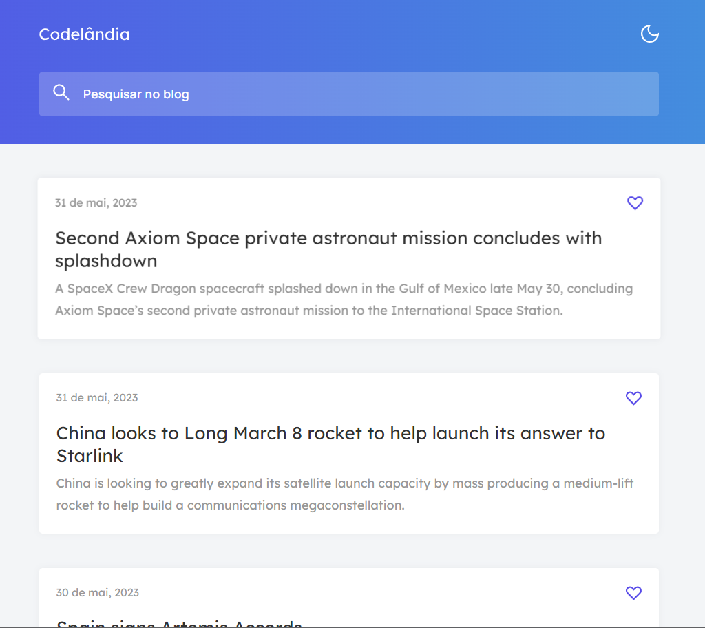

# PÁGINA DE NOTÍCIAS

A proposta inicial deste desafio era replicar o layout de uma página de notícias, colocando os artigos de cada notícia através do HTML e sendo possível favoritar cada bloco de notícias, além de ser responsivo. 

## Principais hard skills utilizadas: 
* HTML semântico;
* Consumo de API; 
* Manipulação de elementos DOM;
* Utilização de Javascript puro.

## Features incluídas:
*  Efeito hover em cada bloco de notícias;
*  Notícias atualizadas atráves do consumo de API;
*  Data personalizada, de acordo com a publicação da notícia;
*  Opção de filtrar as notícias de acordo com as palavras inclusas no título e texto  de cada post;
*  Efeito dark e light mode.
*  Reconhecimento e ativação de preferência do sistema do usuário.

## Tecnologias utilizadas

  
  
  
  
  
  

## Links importantes
Deploy: [Codelândia | News (Veja o projeto ao vivo)](https://647e941d8817b449bf78058c--sparkling-madeleine-51c34d.netlify.app/)  
Linkedin: [Tiago Ribeiro](https://www.linkedin.com/in/tiagoribeirotech/)  
Discord: [Codelândia](https://discord.gg/kZU7B3Xs)

 