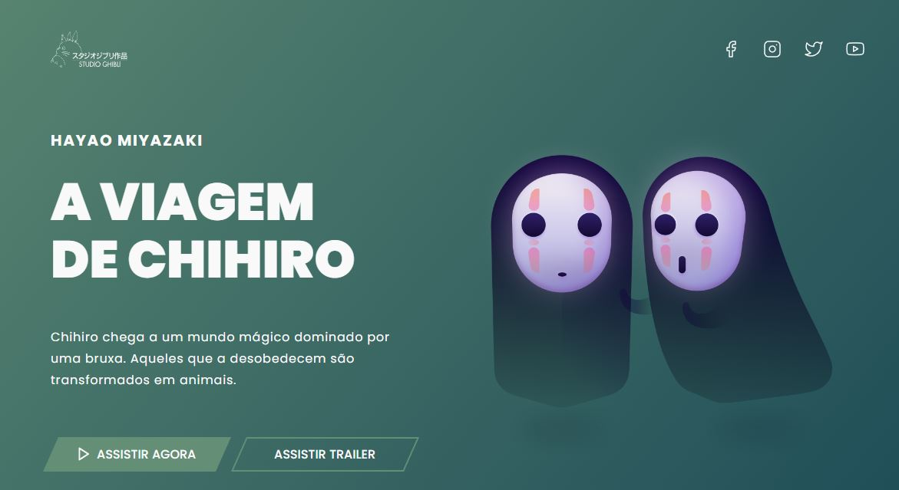

# A viagem de Chihiro

Projeto feito para praticar minhas hard skills em layouts responsivos utilizando media queries e otimização do arquivo css.

## Tecnologias utilizadas

  
   
  
  
  

## Hard Skills desenvolvidas:
* CSS utilitário;
* Utilização de CLEAN CSS para otimização do arquivo CSS;
* Telas responsivas utilizando media queries.

## Links importantes
Deploy: [A viagem de Chihiro (veja o projeto ao vivo)](https://64947dacb399a55266adb3cd--stupendous-blancmange-d82a62.netlify.app/)
  
Linkedin: [Tiago Ribeiro](https://www.linkedin.com/in/tiagoribeirotech/)